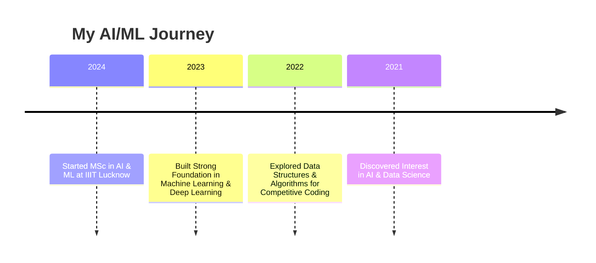

<div align="center">


[](https://git.io/typing-svg)


</div>

---

## 🚀 **About Me**

```python
class AI_ML_Enthusiast:
    def __init__(self):
        self.name = "Pooja Verma"
        self.education = "MSc in AI & ML"
        self.institution = "IIIT Lucknow"
        self.skills = ["Machine Learning", "Deep Learning", "Computer Vision", "MLOps"]
        self.interests = ["AI Research", "Data Science", "Image Processing", "DSA"]
        self.current_focus = "Building real-world AI applications"

    def say_hello(self):
        print("🚀 Let's innovate and build the future with AI!")

me = AI_ML_Enthusiast()
me.say_hello()
```

---

## 🔗 **Connect with Me**
<div align="center">

[](https://www.linkedin.com/in/pooja-verma-a61872317/)
[](https://github.com/pooja30123/)
[](https://leetcode.com/your_leetcode_username/)

</div>

---

## 🔥 **Tech Stack**
### 🚀 AI & Machine Learning


### 📊 Data Science


### 🛠️ Dev Tools


---

## 🎯 **Current Focus**
- 🚀 **Exploring Deep Learning & MLOps**
- 📚 **Mastering Data Structures & Algorithms**
- 🏆 **Practicing Competitive Coding**
- 💡 **Working on AI-based Projects** *(Coming Soon...)*

---

## 📈 **GitHub Stats**
<div align="center">
  
  <p>
    
  </p>

  

</div>

---

## 🐍 **Contribution Snake**
<div align="center">
  
</div>

---

## 📚 **Learning Journey**


---

<div align="center">


🎯 **"Passionate about AI, ML, and Data Science – Let's innovate together!"** 🚀

</div>
